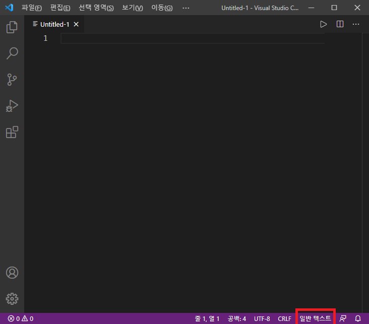
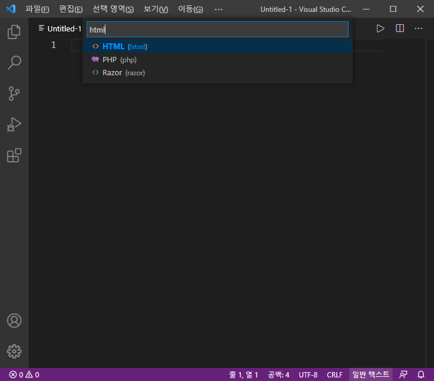
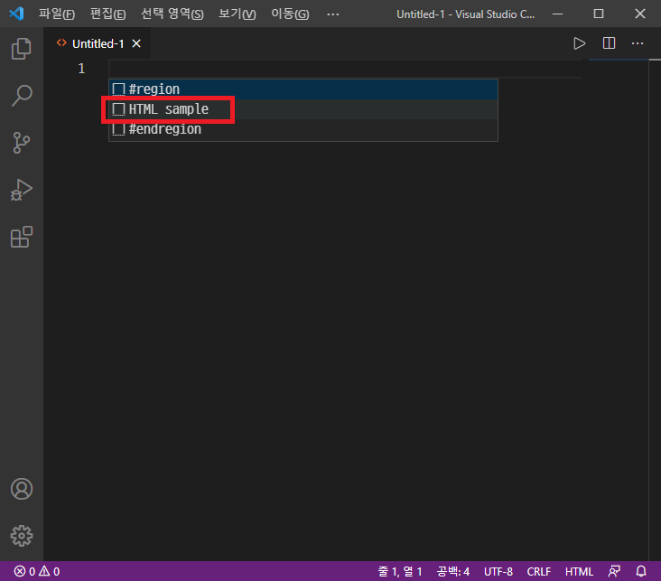
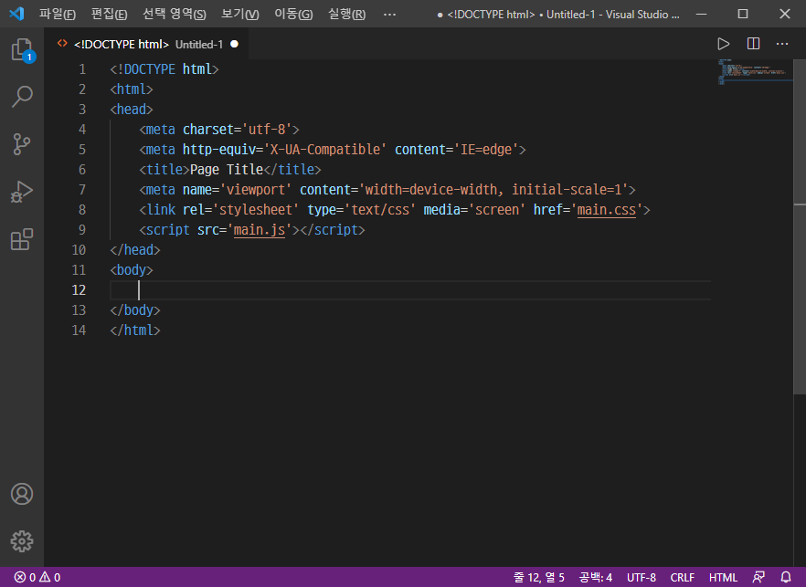
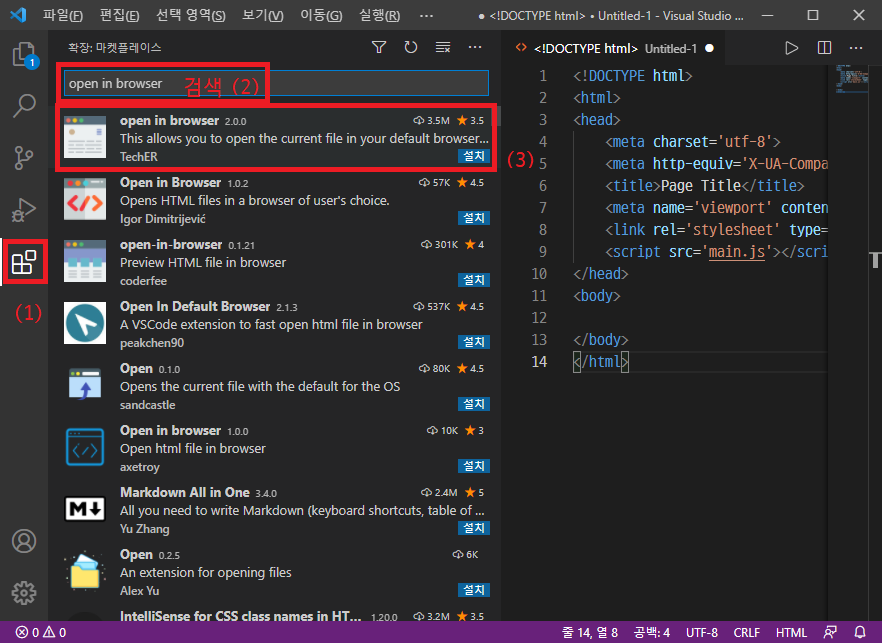
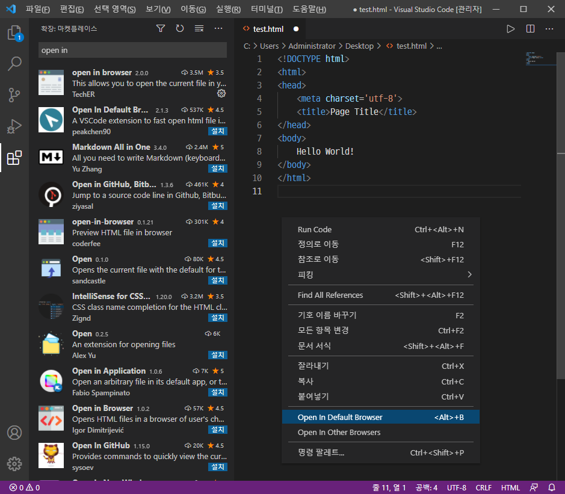
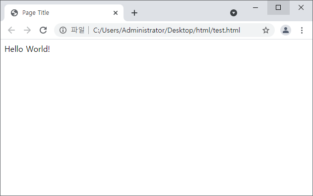
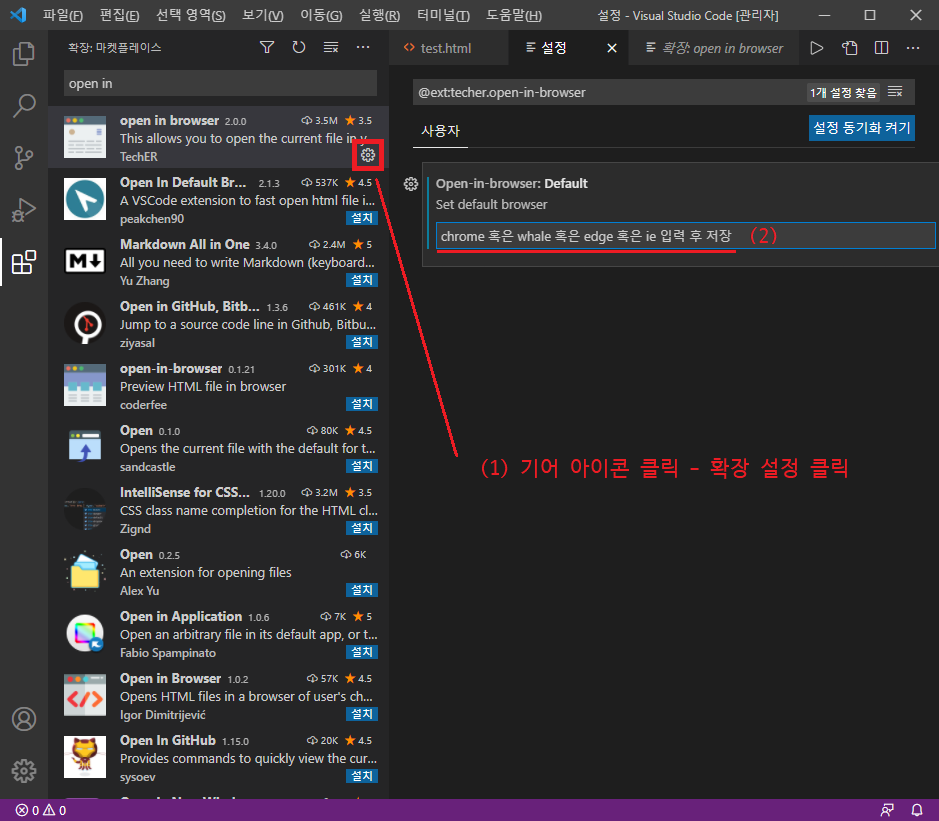

# VS code 에서 html 파일 편집하기
VS code는 편리한 텍스트 에디터이다. 다양한 파일을 연결해주고, 자동완성을 지원한다. 또한 확장 프로그램을 통해 더욱 강력해질 수 있다.

VS code를 통해 html을 편집하고, 브라우저에서 내용을 확인해보자.

> 
> 처음 실행 화면

기본적으로 실행하면 위와 같은 사진이 뜬다. 기본적으론 메모장과 동일한 `일반 텍스트`로 설정되어있다. 우측 하단을 클릭하면 위의 검색창에 파일 종류가 뜰텐데, 여기서 `html`을 입력 후 선택한다.

>   
> html을 눌러준다.

파일의 타입을 html로 지정했기 때문에 html 환경에 대한 자동완성을 지원해준다.

처음 틀을 작성하기 귀찮다면, 커서에서 `Ctrl + space`를 입력하면 자동완성 항목이 뜨는데 여기서 `HTML sample`을 입력을 선택하면 기본 틀을 잡아준다.

>   
> 샘플을 선택하면  
>   
> 자동으로 틀을 잡아준다. 

이렇게 파일을 저장한 후, 저장한 파일을 일일히 더블클릭하면서 내용을 확인할 수도 있지만, 상당히 불편하다.
`open in browser` 플러그인을 설치하면 작성중인 html 파일을 더 편리하게 열 수 있다.

>   
> 플러그인 설치
우측의 벽돌 모양 아이콘을 누르면, 확장 프로그램 목록이 뜬다. 검색창에 `open in browser`를 입력하면 나오는 프로그램 중 가장 위의 것을 설치한다.

>   
> 우클릭시 open in browser 메뉴가 추가됐다.

설치하고 난 후, 에디터에서 우클릭을 하면 `Open in browser`메뉴가 추가된 것을 확인할 수 있다. 이 버튼을 누르면 편집중인 html 파일을 바로 웹 브라우저로 띄워 확인할 수 있다.

샘플 코드는 텍스트 내용이 없어서, 간단하게 코드를 수정했다.

## test.html
```html
<!DOCTYPE html>
<html>
<head>
    <meta charset='utf-8'>
    <title>Page Title</title>
</head>
<body>
    Hello World!
</body>
</html>
```

해당 코드를 입력 후 `open in default browser`를 클릭하면 기본 앱으로 설정된 브라우저로 해당 파일을 열어준다.

이 때 유의사항은, 결국 이 확장프로그램도 저장된 파일을 열어주는 것이기 때문에 수정 사항 반영은 **html 파일을 저장** 한 후에 이뤄진다.
이미 열려있는 브라우저에서도 수정사항이 확인이 안된다면 새로고침을 해보자.


>   
> 실행 화면

'Alt + B'를 통해 단축키로도 열 수 있다. 이 때 다른 앱을 통해 열고 싶다면 `open in browser`를 선택해 프로ㅡ`open in default browser`를 통해 열리는 프로그램을 변경할 수도 있다.

>   
> 옵션 설정
확장프로그램의 옵션 - 확장 설정을 통해, 선택시 열리는 기본 브라우저를 정할 수 있다.
* 크롬 : chrome
* 네이버 웨일 : whale
* 엣지 : edge
* 인터넷 익스플로러 : ie
* 파이어폭스 : firefox

본인이 설치된 프로그램 중 기본으로 선택할 브라우저 이름을 입력해두고 저장하면 된다.
