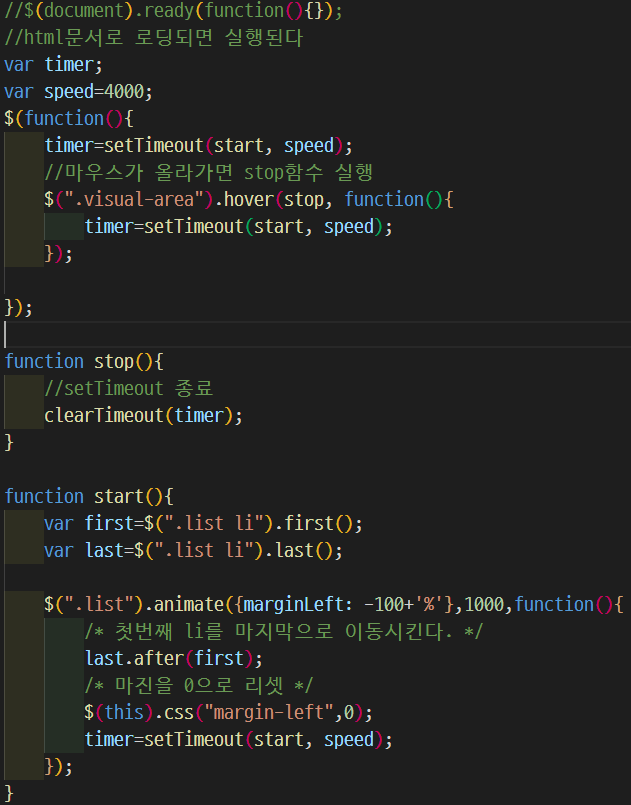
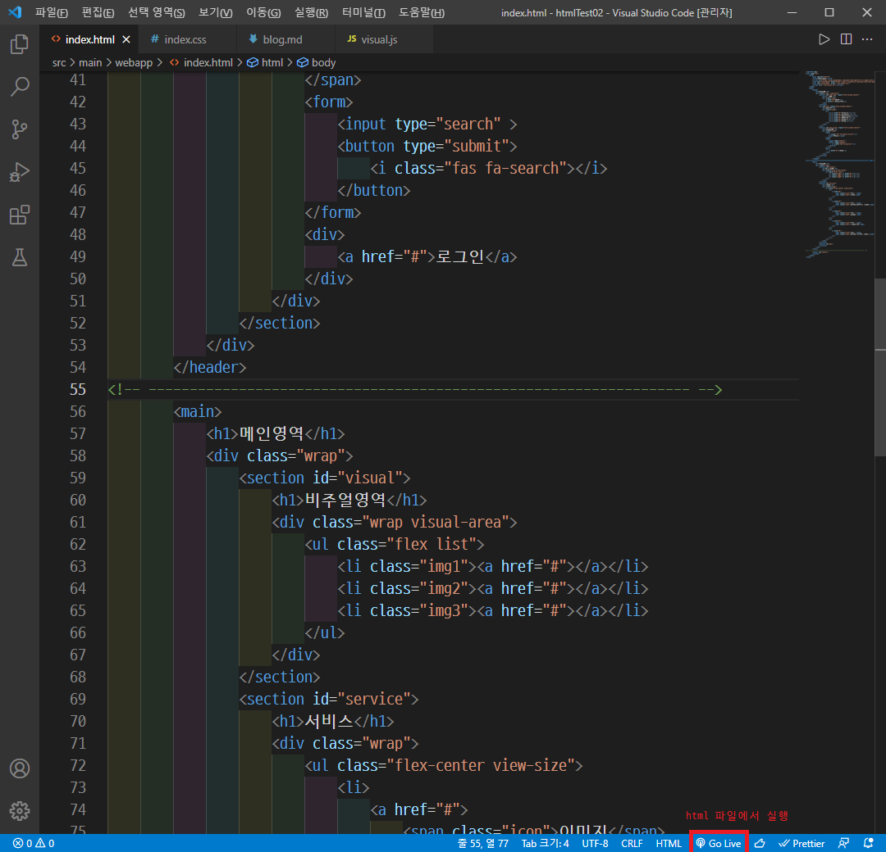

# HTML 편집에 편한 VS Code 확장 프로그램
html, css, javascript를 사용하여 페이지를 만드는 연습을 하고 있다. 하지만 해당 연습을 Eclipse에서 하면 생각보다 불편함을 느꼈다. 그래서 검색을 통해 VS Code 상에서 확장 프로그램을 더해 사용하였더니 더욱 편하게 느꼈다. vs code에서 유용하게 쓰고 있는 확장 프로그램을 공유한다.

## 1. [HTML CSS Support](https://marketplace.visualstudio.com/items?itemName=ecmel.vscode-html-css)
html 파일에서 css의 자동완성을 도와준다. 별도 css 파일에서 작업하는 게 편하지만, 처음에 공부하면서 일부 코드는 html 내에서 적용해보다보니, 해당 기능이 있는 게 편리했다.

## 2. [Rainbow Brackets](https://marketplace.visualstudio.com/items?itemName=2gua.rainbow-brackets)
파일 내 괄호별로 짝에 맞춰 색상을 입력해준다. html과 css에서는 자주 볼 일이 없지만, javascript나 다른 코드 파일을 편집할 때 괄호는 확인하기 유용하다.

## 3. [indent-rainbow](https://marketplace.visualstudio.com/items?itemName=oderwat.indent-rainbow)
들여쓰기로 사용한 tab마다 색상을 입혀줘서 구분시켜준다. 2, 3을 함께 사용하면 화면이 화려한 감은 있지만 코드를 정리하고 쓰는데 도움이 된다.  

## 4. [Live Server](https://marketplace.visualstudio.com/items?itemName=ritwickdey.LiveServer)
html 파일에서 우측 하단의 `Go Live`를 실행시키면, localhost에서 실행하여 화면을 보여준다. 코드 파일을 수정해서 저장하면 브라우저 화면이 바로 갱신되어 실시간으로 편집 결과를 확인하며 코드를 작성할 수 있다. 5번에 비해 편리하여 주로 사용하는 방법이다.  

버튼을 누르면 (local-ip):5500/(파일 경로) 형식으로 띄워준다.
만약 `Go Live`를 눌렀을 때 실행이 안된다면, 확장 설정 - Use Local Ip 에 체크 표시해준다.

## 5. [open in brower](https://marketplace.visualstudio.com/items?itemName=techer.open-in-browser)
편집중인 html 파일을 `Alt + B` 단축키로 바로 열어준다. 수정했을 때는 새로고침이 필요하다. 4번을 사용하기 전에는 자주 사용했다.

## Prettier, Maerial Theme 등 쓸만한 게 많다
검색해보면 사용하기 편한 확장 프로그램들이 많다. 주로 `VS Code (코드 확장자) 확장 프로그램`으로 검색하면 많은 확장 프로그램들이 나온다. 검색하고 써보면서 자신이 편한 환경을 만드는 것도 좋은 준비가 되겠다!
