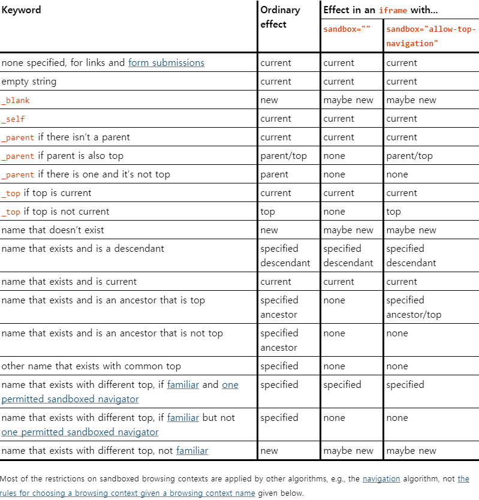

# HTML 태그 정리
수업을 들으며 사용한 태그를 공부하며 정리한다.

# 1. Form 태그
Form 태그는 자식 요소들을 통해 입력받은 여러 정보들을 서버로 한 번에 전송한다. 전송한 데이터를 받아들여 처리를 할 수 있다.

## Form 속성
- **name** : action에 데이터를 전달할 때 사용하는 파라메터. id와 구분할 필요가 있다.
> | 속성값 | 설명 | 중복여부 | 처리방식 |
> | :------: | ----- | :---------: | ---- |
> | id | 페이지 내에서 활용하는 식별자 | 불가능 (단수) | `getElementById()` |
> | name | 컨트롤러까지 가져가서 활용 가능한 식별자. | 가능 (복수) | `getElementsByName()` |

- **action** : 전송 목적지. 데이터를 처리할 곳의 URI를 지정한다. (보통 input의 `type="submit"`으로 제출함)
- **action-charset** : 데이터를 서버로 보낼 때 사용하는 문자 인코딩. (default : "UNKNOWN", 글자 데이터가 깨지는 것을 대비하여 설정한다.)
- **method** : 전송 방식. 양식을 제출할 때 사용할 메서드. (GET or POST, default : GET)
- **target** : 데이터를 서버로 전송한 후, 응답을 표시할 위치를 명시한다.
> | 속성값 | 설명 |
> | :------: | ----- |
> | _self | **기본값**이자 생략 가능. 현재 프레임에서 보여준다. |
> | _blank | 새로운 프레임에서 보여준다. |
> | _parent | 부모 프레임에 보여준다. 부모 프레임이 존재하지 않을 경우 _self와 동일하다.  |
> | _top | 계층상 최상단 프레임에 표시한다. 부모 프레임이 존재하지 않을 경우 _self와 동일하다. |
> | (프레임 이름) | 명시된 프레임(iframe)에 보여준다. |
더욱 자세한 내용은 [HTML5 명세](https://www.w3.org/TR/html52/sec-forms.html#the-form-element)에서 발췌한 아래 사진을 참고한다.
> 
- **enctype** : 데이터 형식 지정. 형식을 지정해주어야 받아들인 데이터를 맞게 처리할 수 있다. (default : application/x-www-form-urlencoded)
> | 속성값 | 설명 |
> | ------ | ----- |
> | application/x-www-form-urlencoded | **기본값**. 모든 문자들은 서버로 보내기 전에 **인코딩됨을 명시**한다. |
> | multipart/form-data | 모든 문자를 인코딩하지 않음을 명시한다. 이 방식은 form 요소가 **파일이나 이미지를 서버로 전송할 때** 주로 사용한다. |
> | text/plain | 공백 문자(space)는 "+" 기호로 변환하지만, **나머지 문자는 모두 인코딩되지 않음을 명시**한다. |

- novalidate : 유효성 검사 유무. 해당 태그를 명시하면 유효성 검사를 건너뛰고 데이터를 전송한다. (예를들어, `type="email"에 대해 명시하면, '@'를 포함한 문자열인지 검증하지 않는다. HTML5에서 추가)
- **autocomplete** : 자동완성. 사용자가 이전에 입력한 값을 드롭다운 옵션으로 보여줄지에 대한 설정 (on or off, HTML5 에서 추가)

# 2. Form 자식 요소
자식 요소는 공통 속성을 갖고 있다.
- **disabled** : 해당 항목을 비활성화한다.

## input
사용자에게 입력 받을 데이터의 양식을 지정한다.

## input 속성
- **type** : 다양한 데이터를 받기위한 형식을 지정해준다.
> | 속성값 | 설명 |
> | ------ | ----- |
> | text | 한 줄을 입력 받는 필드 (size, maxlength 속성 사용 가능) | 
> | password | 입력받은 데이터를 가려주는 필드 | 
> | number | 숫자만 입력 받는 필드 |
> | email | 이메일인지 (@가 포함된 문자열인지) 검증해주는 필드 |
> | search | 검색 필드 (text와 유사) |
> | tel | 전화번호를 입력할 수 있도록 검증해주는 필드 |
> | url | 주소를 입력받도록 검증해주는 필드 |
> | file | 파일 입력 필드 |
> | radio | 라디오 버튼. 여러 개 중 하나만 선택 가능 |
> | checkbox | 체크박스. 여러 개 중 원하는만큼 선택 가능 (checked 속성 사용) |
> | date | 날짜를 입력받는다. (년, 월, 일) |
> | month | 월을 입력받는다. (년, 월) |
> | week | 몇년 몇주차를 입력받는다. (년, 주차) |
> | time | 시간을 입력받는다. (시, 분) |
> | datetime-local | 날짜와 시간을 입력받는다. (년, 월, 일, 시, 분) |
> | color | 색을 입력 받을 때 사용. (000000 ~ ffffff까지) |
> | range | 값의 입력 범위를 지정하여 입력 받는다. |
> | button | 버튼. `<button>`처럼 사용한다. |
> | submit | 폼의 데이터를 action으로 제출하는 버튼 |
> | image | 이미지 형태의 버튼으로 submit 실행 |
> | hidden | 사용자에게 노출되선 안되는 데이터를 폼에 담아 전송할 때 사용 |
- **required** : 반드시 입력되어야하는 항목을 지정한다. (대부분 가능)
- **multiple** : 여러 값 입력 설정. (email, file에만 가능)
- autofocus : 페이지 로드시 초점을 받도록 한다.
- readonly : 설정시 내부 값을 수정할 수 없다. 읽기만 가능하다.
- pattern : 정규 표현식에 의해 입력받는 값을 조정할 수 있다. (text, search, url, tel, email, password에만 가능)
- min, max : 최대 최소 값을 지정한다. (number, range, date, datetime, datetime-local, month, time, week에만 가능)
- step : 값의 변화 단계를 지정한다. min, max와 함께 사용
- novalidate
- autocomplete

각 속성별 사용은 [input 별 형태](./input-type.md)에서 참고할 수 있다.

## label
form 내의 요소들에 대해 설명을 붙여준다. `for`를 통해 다른 요소의 `id`와 연결하여 사용한다.
> ```html
> <label for="subject">제목</label>
> <input type="text" id="subject" />
> ```
> 결과 : 
> <label for="subject">제목</label> <input type="text" id="subject" />

## select
사용자가 폼에서 사용할 수 있는 리스트 목록을 보여준다. 여러개의 주어진 값 중에서 선택하도록 할 때 사용할 수 있다.
> ```html
> <label for="like-sport">좋아하는 종목</label>
> <select name="sport" id="like-sport">
>     <option value="soccer">축구</option>
>     <option value="baseball">야구</option>
>     <option value="basketball">농구</option>
>     <option value="volleyball">배구</option>
> </select>
> ```
> 결과 : 
> <label for="like-sport">좋아하는 종목</label>
> <select name="sport" id="like-sport">
>     <option value="soccer">축구</option>
>     <option value="baseball">야구</option>
>     <option value="basketball">농구</option>
>     <option value="volleyball">배구</option>
> </select>
## select 속성
- **multiple** : 다중 선택 가능하도록 한다. (Ctrl or Shift or 드래그를 통해 여러 개 선택)
- **size** : 값을 몇 개 보여줄지 지정. (default : select = 1, multiple = 4)
- **optgroup** : option을 그룹화한다.
> ```html
> <select>
>     <optgroup label="그룹1">
>         <option value="">내용1</option>
>         <option value="">내용2</option>
>     </optgroup>
>         <optgroup label="그룹2">
>         <option value="">내용3</option>
>         <option value="">내용4</option>
>     </optgroup>
> </select>
> ```
> 결과 : 
> <select>
>     <optgroup label="그룹1">
>         <option value="">내용1</option>
>         <option value="">내용2</option>
>     </optgroup>
>         <optgroup label="그룹2">
>         <option value="">내용3</option>
>         <option value="">내용4</option>
>     </optgroup>
> </select>

## button
input에 있었던 type인 submit, button, ~~reset~~(사용자의 실수를 유발할 수 있어 비권장 속성이다.)을 대체할 수 있다. input과의 차이점은, button은 열고 닫는 태그이므로 button 내에 span, img 같은 인라인 요소를 포함할 수 있다.
> ```html
> <input type="button" value="input을 사용한 버튼"/>
> <button type="button">button을 사용한 <strong>강한 버튼</strong></button>
> ```
> 결과 : 
> <input type="button" value="input을 사용한 버튼"/>
> <button type="button">button을 사용한 <strong>인라인 요소</strong>를 넣은 버튼</button>

# 3. 다른 태그

## a
`href` 속성을 통해 다른 파일, 페이지, 위치 등 다양한 곳으로 연결할 수 있는 하이퍼링크를 만든다.

## a 속성
 - download : 링크로 이동하는 대신, url의 데이터를 저장할 것인지 확인한다.
 - target : 링크를 표시할 위치. form에서 설명한 내용과 동일

## textarea
`<input type="text"/>`와 달리, 여러 줄을 입력받도록 하는 텍스트 컨트롤. 

## textarea 속성
- disabled
- maxlength, minlength
- readonly
- required
- **placeholder** : 안내문구
- **form** : 해당 속성에 form의 id와 연결하여, form 태그 바깥에 위치하는 textarea의 내용을 연결된 form 제출시에 함께 전달할 수 있다.
> ```html
> <form id="ff">
> <button type="submit">제출</button>
> </form>
>
> <textarea name="area" form="id" placeholder="form 태그 바깥에 있어도 함께 데이터 전송이 가능하다."></textarea>
> ```

## ul, ol, dl
- ul : 순서가 의미없는 자료들을 나열할 때 사용. li로 나열한다.
- ol : 순서가 필요한 자료들을 나열할 때 사용. li로 나열한다.
> ```html
> <ul>
>   <li>ul의 항목A</li>
>   <li>ul의 항목B</li>
> </ul>
> <ol>
>   <li>ol의 항목1</li>
>   <li>ol의 항목2</li>
> </ol>
> ```
> 결과 : 
> <ul>
>   <li>ul의 항목A</li>
>   <li>ul의 항목B</li>
> </ul>
> 
> <ol>
>   <li>ol의 항목1</li>
>   <li>ol의 항목2</li>
> </ol>
- dl : 설명 목록. 주로 설명을 기록하거나 메타데이터(key - value 형태 등)를 표시할 때 사용한다. dt와 dd를 통해 나열한다.
> ```html
> <!-- 1:1 관계가 아니어도 상관없다. -->
> <dl>
>   <dt>키1</dt>
>   <dd>값1</dd>
>   <dd>값2</dd>
>
>   <dt>키2</dt>
>   <dd>값3</dd>
>
>   <dt>키3</dt>
>   <dt>키4</dt>
>   <dd>값5</dd>
> </dl>
> ```
> 결과 : 
> <dl>
>   <dt>키1</dt>
>   <dd>값1</dd>
>   <dd>값2</dd>
>
>   <dt>키2</dt>
>   <dd>값3</dd>
>
>   <dt>키3</dt>
>   <dt>키4</dt>
>   <dd>값5</dd>
> </dl>

# 참고 사이트 
 - [HTML 요소 총정리](https://heropy.blog/2019/05/26/html-elements/)
 - [html Form 요소](http://webberstudy.com/html-css/html-3/)
 - [MDN web doc html](https://developer.mozilla.org/ko/docs/Web/HTML)
