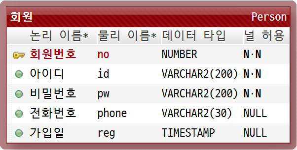
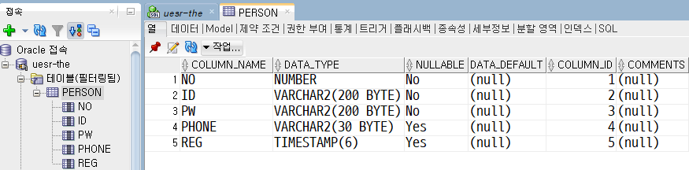
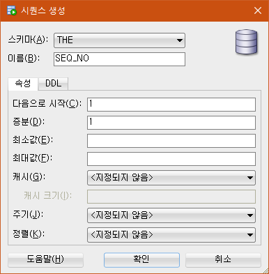
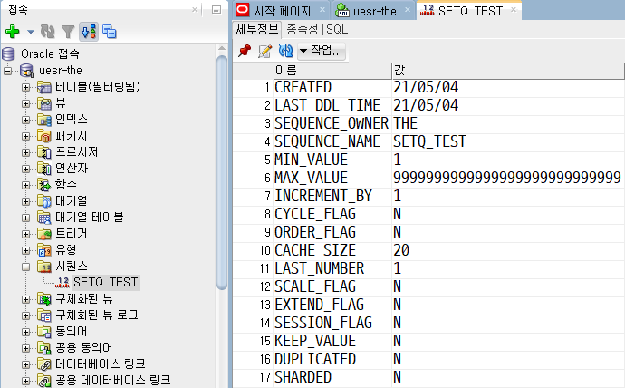

# 과제(이승주)



## 1. ER다이어그램을 참조하여 Oracle DB에 테이블을 생성하세요.
- 실행 쿼리문  
```sql
CREATE table person (
    no NUMBER not null primary key,
    id VARCHAR2(200) not null,
    pw VARCHAR2(200) not null,
    phone VARCHAR2(30),
    reg TIMESTAMP
);
```
- 실행 결과  


## 2. no에 데이터 시퀀스를 참고하여 입력하기 위한 시퀀스를 만들어주세요.
- 처리 방법  
좌측 메뉴 - 시퀸스 - 우클릭 하여 '새 시퀸스' 실행, 내용 입력  
 
- 실행 결과  
 

## 3. 첫 번째 데이터를 입력하는 쿼리를 작성하세요.<br>컬럼명을 생략하고 작성하세요.
> - no : 시퀸스에서 참조
> - id : test1
> - pw : 1234
> - phone : 010-1111-1111
> - reg : 시스템 날짜 적용
- 실행 쿼리문  
```sql
insert into person
values (SEQ_NO.nextval, 'test1', '1234', '010-1111-1111', sysdate);
```
- 실행 결과(`select * from person;`)  


## 4. 두 번째 데이터를 입력하는 쿼리를 작성하세요.<br>컬럼명을 지정하고 작성하세요
> - no : 시퀸스에서 참조
> - id : test2
> - pw : 1234
> - phone : 010-2222-2222
> - reg : 시스템 날짜 적용
- 실행 쿼리문  
```sql
insert into person(no, id, pw, phone, reg)
values (SEQ_NO.nextval, 'test2', '1234', '010-2222-2222', sysdate);
```
- 실행 결과(`select * from person;`)  


## 5. 세 번째 데이터를 입력하는 쿼리를 작성하세요.<br>컬럼명을 지정하고 작성하세요. `person(no, pw, id)`
> - no : 시퀀스에서 참조
> - id : test3
> - pw : 1234
- 실행 쿼리문  
```sql
insert into person(no, pw, id)
values (SEQ_NO.nextval, '1234', 'test3');
-- 입력된 칼럼명 순서에 맞게 데이터 입력
```
- 실행 결과(`select * from person;`)  


## 6. id가 test03인 데이터에 수정하세요.
> - phone : 010-3333-3333
> - reg : 2021-05-01 날짜 적용
- 실행 쿼리문  
```sql
UPDATE person
SET phone='010-3333-3333', reg = to_timestamp('20210501', 'YYYYMMDD')
where id='test3';
-- TIMESTAMP 값을 입력하기 위해
-- to_timestamp('날짜 혹은 시간 값', '날짜 혹은 시간 포맷')
-- 으로 원하는 시간을 입력 가능하다.
```
- 실행 결과(`select * from person;`)  


## 7. 지금까지 변경한 정보를 확정하세요.
- 실행 쿼리문  
```sql
commit; -- 실행한 쿼리문을 DB에 반영
```
- 실행 결과  
  
실행시 "커밋 완료."라는 스크립트가 출력된다.

## 8. id가 test2인 회원정보를 삭제하세요.
- 실행 쿼리문  
```sql
delete from person
where id='test2';
-- id가 test2인 데이터 삭제
```
- 실행 결과(`select * from person;`)  


## 9. 8번에서 삭제한 정보를 복구시키세요.
- 실행 쿼리문  
```sql
rollback; -- 실행한 쿼리문을 DB에 반영하지 않고 복원
```
- 실행 결과(`select * from person;`)  
  
test2 삭제가 DB에 반영되지 않고 복원되었다.

## 10. 테이블은 구조는 유지하고 데이터를 모두 삭제하세요.
- 실행 쿼리문  
```sql
delete from person; -- 전부 삭제
```
- 실행 결과(`select * from person;`)  
  
테이블 내 데이터가 전부 삭제되었다.
