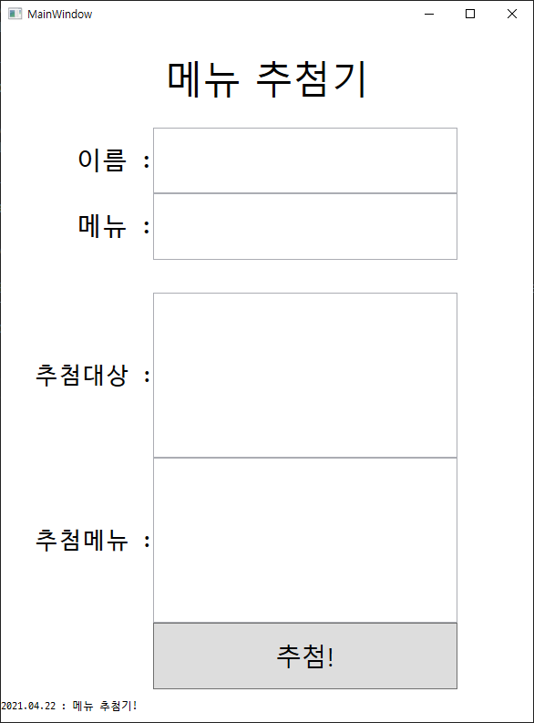
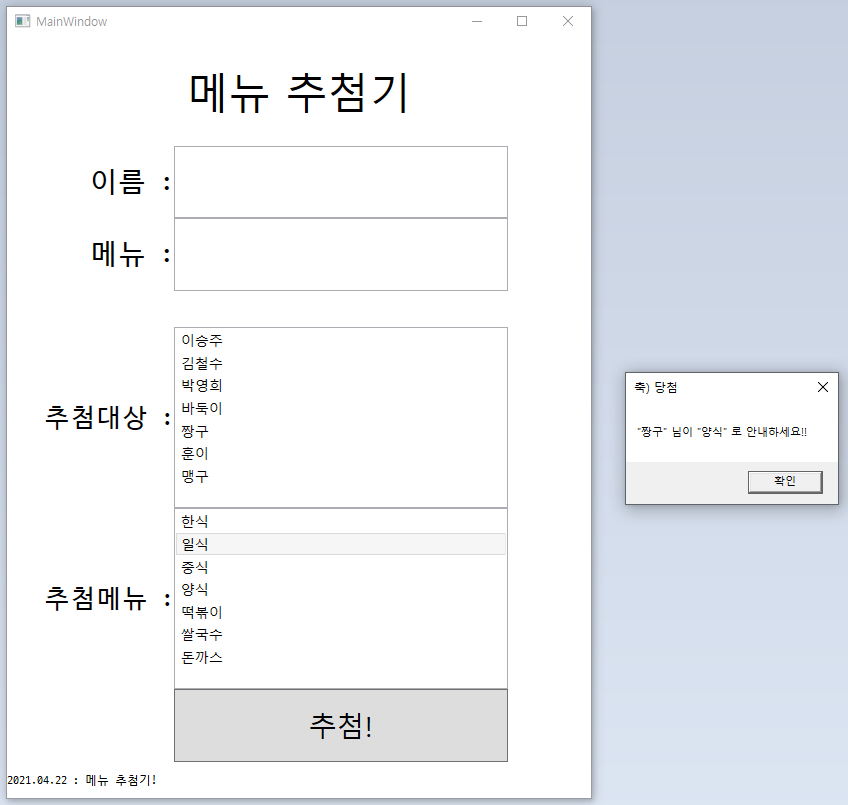
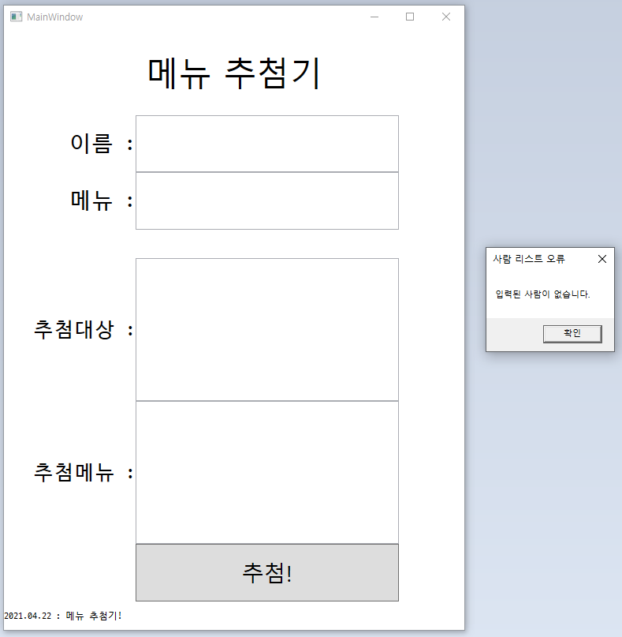

## 개요
매 점심마다 무엇을 먹을지 고민하는 게 참 어려운 일이다. 같이 공부하는 사람과 상의해서 정하곤 하는데, 매번 상의해서 정하는 것도 시간적 소요가 있다.

그래서 졸업작품을 했던 기억을 더듬어, C#과 WPF를 이용해 **사람 목록**과 **메뉴 목록**을 입력 받고 그 중에 한가지씩을 골라 알려주는 프로그램을 만들었다.

창은 1개만 구현했고, 결과는 `MessageBox`를 통해 알려주기로 한다.

## 코드

### MainWindow.xaml
```xml
<Window x:Class="WpfApp1.MainWindow"
        xmlns="http://schemas.microsoft.com/winfx/2006/xaml/presentation"
        xmlns:x="http://schemas.microsoft.com/winfx/2006/xaml"
        xmlns:d="http://schemas.microsoft.com/expression/blend/2008"
        xmlns:mc="http://schemas.openxmlformats.org/markup-compatibility/2006"
        xmlns:local="clr-namespace:getLunch"
        mc:Ignorable="d"
        Title="MainWindow" Height="800" Width="600">
    <Grid>
        <Grid.RowDefinitions>
            <RowDefinition Height="3*"/>
            <RowDefinition Height="2*"/>
            <RowDefinition Height="2*"/>
            <RowDefinition Height="1*"/>
            <RowDefinition Height="5*"/>
            <RowDefinition Height="5*"/>
            <RowDefinition Height="2*"/>
            <RowDefinition Height="1*"/>
        </Grid.RowDefinitions>
        <Grid.ColumnDefinitions>
            <ColumnDefinition Width="2*"/>
            <ColumnDefinition Width="4*"/>
            <ColumnDefinition Width="1*"/>
        </Grid.ColumnDefinitions>
        <TextBlock Grid.ColumnSpan="3" Grid.Row="0" HorizontalAlignment="Center" VerticalAlignment="Center" Text="메뉴 추첨기" FontSize="42"/>

        <TextBlock Grid.Column="0" Grid.Row="1" FontFamily="D2Coding" HorizontalAlignment="Right" VerticalAlignment="Center" FontSize="28">
            이름 :
        </TextBlock>
        <TextBox Grid.Column ="1" Grid.Row="1" Name="InputPeople" FontSize="28" KeyDown="InputPeople_KeyDown"/>

        <TextBlock Grid.Column="0" Grid.Row="2" FontFamily="D2Coding" HorizontalAlignment="Right" VerticalAlignment="Center" FontSize="28">
            메뉴 :
        </TextBlock>
        <TextBox Grid.Column ="1" Grid.Row="2" Name="InputMenu" FontSize="28" KeyDown="InputMenu_KeyDown"/>

        <TextBlock Grid.Column="0" Grid.Row="4" FontFamily="D2Coding" HorizontalAlignment="Right" VerticalAlignment="Center" FontSize="26">
            추첨대상 :
        </TextBlock>
        <ListBox Grid.Column="1" Grid.Row="4" Name="ListPeople" FontSize="14"/>
        
        <TextBlock Grid.Column="0" Grid.Row="5" FontFamily="D2Coding" HorizontalAlignment="Right" VerticalAlignment="Center" FontSize="26">
            추첨메뉴 :
        </TextBlock>
        <ListBox Grid.Column="1" Grid.Row="5" Name="ListMenu" FontSize="14"/>

        <TextBlock Grid.ColumnSpan="2" Grid.Row="7" FontFamily="D2Coding" VerticalAlignment="Center">
            2021.04.22 : 메뉴 추첨기!
        </TextBlock>
        
        <Button Grid.Column="1" Grid.Row="6" Name="GetBtn" Content="추첨!" FontSize="28" Click="GetBtn_Click"/>
    </Grid>
</Window>
```

화면 구성은 다음과 같다.



### MainWindow.xaml.cs
```cs
using System;
using System.Collections.Generic;
using System.Windows;
using System.Windows.Input;

namespace getLunch
{
    /// <summary>
    /// Interaction logic for MainWindow.xaml
    /// 사람과 메뉴 입력을 받고 그 중에 하나를 추첨해서 반환함
    /// </summary>
    public partial class MainWindow : Window
    {
        public MainWindow()
        {
            InitializeComponent();
        }

        private void GetBtn_Click(object sender, RoutedEventArgs e)
        {
            // 추첨 함수

            // 사람, 메뉴 리스트에서 데이터를 다 가져옴
            List<string> allListPeople = new List<string>();
            List<string> allListMenu = new List<string>();

            foreach (string input_items in ListPeople.Items)
            {
                allListPeople.Add(input_items);
            }

            foreach (string input_items in ListMenu.Items)
            {
                allListMenu.Add(input_items);
            }

            // 리스트가 비어있는건 아닌지 확인
            if (allListPeople.Count == 0)
            {
                // 사람 입력이 없을 경우
                MessageBox.Show("입력된 사람이 없습니다.", "사람 리스트 오류", MessageBoxButton.OK);
            }
            else if (allListMenu.Count == 0)
            {
                // 메뉴 입력이 없을  경우
                MessageBox.Show("입력된 메뉴가 없습니다.", "메뉴 리스트 오류", MessageBoxButton.OK);
            }
            else
            {
                // 뽑힌 사람, 메뉴의 index를 추첨 (random)
                Random r = new Random();
                int choicePeople = r.Next(0, allListPeople.Count);
                int choiceMenu = r.Next(0, allListMenu.Count);

                // 당첨 결과 출력
                MessageBox.Show("\"" + allListPeople[choicePeople] + "\" 님이 \"" + allListMenu[choiceMenu] + "\" 로 안내하세요!!", "축) 당첨", MessageBoxButton.OK);
            }
            
        }

        private void InputMenu_KeyDown(object sender, KeyEventArgs e)
        {
            // 메뉴를 입력 받아서 ListMenu에 넣어줌
            String menu;
            
            switch (e.Key)
            {
                case Key.Enter:
                    menu = InputMenu.Text;
                    ListMenu.Items.Add(menu);
                    InputMenu.Text = "";    // textbox의 내용 초기화
                    break;
                default:
                    break;
            }
        }

        private void InputPeople_KeyDown(object sender, KeyEventArgs e)
        {
            // 메뉴를 입력 받아서 ListPeople에 넣어줌
            String people;

            switch (e.Key)
            {
                case Key.Enter:
                    people = InputPeople.Text;
                    ListPeople.Items.Add(people);
                    InputPeople.Text = "";  // textbox의 내용 초기화
                    break;
                default:
                    break;
            }
        }
    }
}
```

위의 이름과 메뉴 옆의 `TextBox`에서 입력한 후 엔터를 입력하면, 아래의 `ListBox`에 해당 내용을 추가하는 구조로 되어 있다.
그 후에 추첨 `Button`을 누르면 `ListBox`의 값들을 가져와서, 그 중에 한가지씩을 골라서 반환한다.

`TextBox`의 이벤트에 각각 `InputPeople_KeyDown()`과 `InputMenu_KeyDown()`을 추가했다. 동작 방식은 동일하기 때문에, sender를 통해 이벤트를 통합 할 수도 있겠다.

`Button`의 이벤트에는 `GetBtn_Click()`을 사용했는데, `List<string>`에 리스트의 모든 값을 다 담아둔 뒤, 0 ~ List<string>.Count 까지의 값 중에 하나를 반환하여 조회, 출력한다.

별도의 창을 구성하는 것 보다, `MessageBox`를 이용하는 것이 더욱 간편하여 결과를 알려주었다.



혹시나 메뉴나 사람이 입력되지 않았을 경우를 대비해, 리스트가 비었을 경우 추첨을 진행하지 않는다.




## 소감
졸업작품 때 WPF를 이용하여 tts를 출력했는데, 오랜만에 WPF와 C#을 이용하여 즐거운 경험이었다. 기본에 충실한 디자인이지만 잘 작동하는 게 뿌듯하다.
